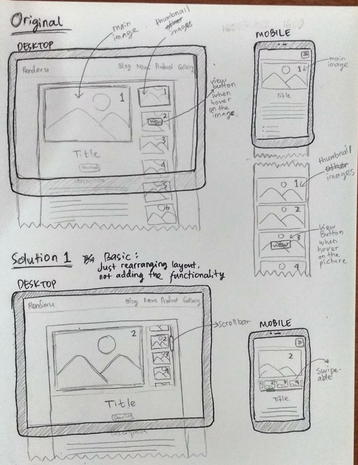

# Sketching and Prototyping

## Part A: Sketches

### 1. Scan/Photo of Sketches


### 2. Version Differences
```
Please write a paragraph talking about the differences between the versions
```

### 3. Selected Sketch
```
Please write a paragraph telling us about which design you picked for Parts B and C 
and why you selected it.
```

### 4. Design Rationale
```
"What's good for developers, not always good for users"
"Don't assume that the user has experience like yours"
```

## Part B: Assumptions
### 1. Hardware
```
Desktop :
- Screen resolution 1366x768 or higher, with 16:9 aspect ratio
- Input device : mouse, keyboard

Mobile :
- Screen resolution 720x1280 or higher, with 16:9 aspect ratio
- Input device : touchscreen
```
### 2. Users
```
Beginner to familiar with web browser
Should be familiar with desktop & mobile
Age : 12-50 years
```

## Part C: Prototypes
We will work on this part together during the class on **March 22nd, 2019**, 10:00 AM - 12.30 PM. Therefore, prior to the class please complete all the above parts (A & B) beforehand accordingly.
