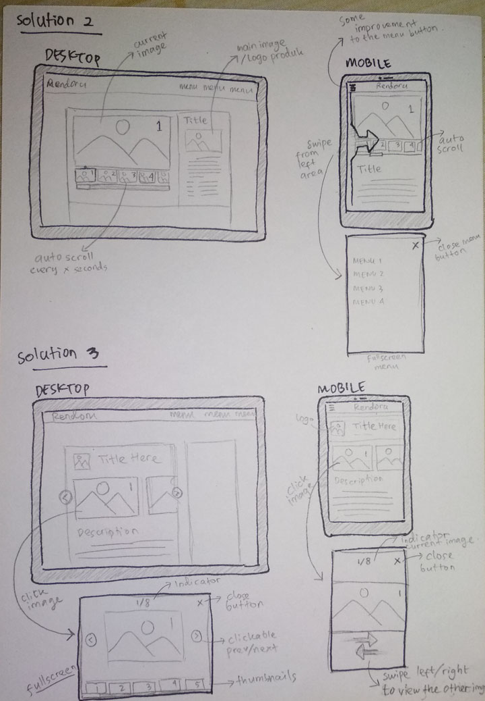

# Sketching and Prototyping

## Part A: Sketches

### 1. Scan/Photo of Sketches



### 2. Version Differences

#### Solution 1
- Wrap the thumbnail images and add the scrollbar (swipeable for mobile version)
- Thumbnail images is next to the current image

#### Solution 2
- Same as solution 1, but the thumbnail images is under the current image (DESKTOP VERSION)
- Autoscroll (auto change current image) every few seconds
- rearrange the navigation menu, add swipe-from-left function to open the menu, and add close button to close the menu (MOBILE VERSION)

#### Solution 3
- remove the mini-thumbnails
- add prev/next button (DESKTOP)
- if clicked on any image, a fullscreen image display will appear

### 3. Selected Sketch
```
Solution 2, because :
- easy to open menu on mobile with swipe function
- auto scroll images will attract the user's attention to not skip all of images
```

### 4. Design Rationale
```
"What's good for developers, not always good for users"
"Don't assume that the user has experience like yours"
```

## Part B: Assumptions
### 1. Hardware
```
Desktop :
- Screen resolution 1366x768 or higher, with 16:9 aspect ratio
- Input device : mouse, keyboard

Mobile :
- Screen resolution 720x1280 or higher, with 16:9 aspect ratio
- Input device : touchscreen
```
### 2. Users
```
Beginner to familiar with web browser
Should be familiar with desktop & mobile
Age : 12-50 years
```

## Part C: Prototypes
We will work on this part together during the class on **March 22nd, 2019**, 10:00 AM - 12.30 PM. Therefore, prior to the class please complete all the above parts (A & B) beforehand accordingly.
